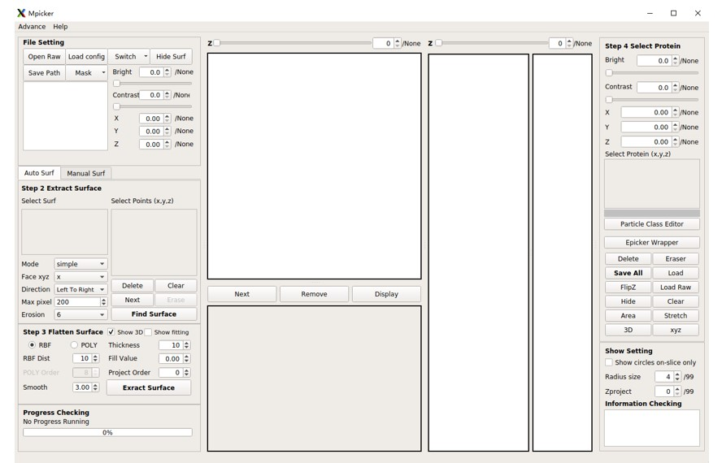

# Installation

We provide two methods to install MPicker: using Conda or using an offline package without Conda. We recommend using Conda because the offline package is quite large and contains all required libraries.

Two libraries, OptCuts and Membrane segmentation, are optional for installation. OptCuts is a third-party library for MPicker, required only if the surface needs to be flattened by the triangle-mesh method. By default, MPicker contains the library for AI-based membrane segmentation, but a version without membrane segmentation, which is smaller in size, is also provided. For full functionality of MPicker, it is recommended to install both libraries.

After installation, it is recommended to go through the [Tutorial](https://thuem.net/software/mpicker/tutorial.html) before using MPicker on personal data.

The following is the instruction to install MPicker.

## Installation Guide

### Install using Conda

Before the installation, Conda must be available on the system. Conda can be found at [https://docs.conda.io/projects/miniconda/en/latest/](https://docs.conda.io/projects/miniconda/en/latest/).

- Download `MPicker_code_vxxx.tar.gz`. (xxx is the version number)
- Uncompress it into an empty folder. Let's call it `MPicker_Root/`. Replace it with the actual path where MPicker will be installed.
  ```bash
  mkdir MPicker_root
  tar -zxvf MPicker_code_vxxx.tar.gz -C MPicker_Root
  ```
- Edit the `env.yml` file in the folder `MPicker_Root/mpicker_gui`:
  - Change "`name: mpickerxxx`" (xxx is the version number, like mpicker1.2) to the preferred environment name.
  - Modify "`cudatoolkit=11.0`" to another version if the GPU driver doesn't support it (e.g., =10.1 or =9.2).
  - The library versions don't have to match exactly as in the yml file. The versions provided are just one workable combinations that has been tested. However, `scipy>=1.7`, `yacs>=0.1.8`, and `pyqt=5` must be satisfied. `open3d=0.9.0` is chosen for compatibility with older systems, but newer versions are allowed if the machine supports it.
- Create the Conda environment from this file (may take 10 minutes or more):
  ```bash
  conda env create -f MPicker_Root/mpicker_gui/env.yml
  ```
- Finally, activate the environment with:
  ```bash
  conda activate mpickerxxx
  ```

### Install using the offline package

The offline package is generated using conda-pack on CentOS7, but it should work for other Linux systems. Conda must be used if the system is not Linux.

- Download `MPicker_environment_vxxx.tar.gz` and `MPicker_code_vxxx.tar.gz`.
- Uncompress them into two **different** empty folders. Let's call them `MPicker_Root` and `MPicker_Root_Env`. Replace them with the real paths where MPicker will be installed.
  ```bash
  mkdir MPicker_Root
  tar -zxvf MPicker_code_vxxx.tar.gz -C MPicker_Root
  mkdir MPicker_Root_Env
  tar -zxvf MPicker_environment_vxxx.tar.gz -C MPicker_Root_Env
  ```
- Unpack the Conda environment (only need to do this once):
  ```bash
  source MPicker_Root_Env/bin/activate
  conda-unpack
  source MPicker_Root_Env/bin/deactivate
  ```

After installation, activate the environment using:
```bash
source MPicker_Root_Env/bin/activate
```
and deactivate it using:
```bash
source MPicker_Root_Env/bin/deactivate
```

### Install without Class2D and Membrane Segmentation
This version doesn't include PyTorch, so 2D classification and AI-based automatic membrane segmentation can not work, but it has a smaller installation size.
- Replace `MPicker_code_vxxx.tar.gz` with `MPicker_code_noseg_vxxx.tar.gz` in the above installation instructions. The latter lacks the folder `memseg_v3` (includes a pretrained model about 70M). Set up the conda environment by `env_simple.yml` rather than `env.yml`.
- Replace `MPicker_environment_vxxx.tar.gz` with `MPicker_environment_noseg_vxxx.tar.gz` in the above installation instructions if setting up the environment without Conda.

### Install OptCuts
The software [OptCuts](https://github.com/liminchen/OptCuts) needs to be installed and added to the PATH if the surface needs to be flattened by triangle mesh (see [Advanced Tutorial](https://thuem.net/software/mpicker/tutorial_advance.html#flatten-surface-by-triangle-mesh)). Some modifications were made in its main.cpp for better performance, so just download the package from the page **Download** ([here](https://thuem.net/software/mpicker/download.html)).

To install it, CMake and a C++ compiler are required. Then:
```bash
tar -zxvf OptCuts_MPicker.tar.gz
cd OptCuts_MPicker
mkdir build
cd build
cmake ..
make -j 4  # OR cmake --build .
# ONLY for Windows users: copy the file stb_image/libigl_stb_image.dll into bin/
```
Check if the software was installed successfully by:
```bash
./bin/OptCuts_bin 100 ../bunny.obj 0.999 1 0 4.1 1 0
# change 100 to 0 to show the process (start it by pressing "/")
```
Assume the current path is `/your/path/OptCuts_MPicker/build`, add OptCuts to the path by adding this line to the `.bashrc` file:
```bash
export PATH=/your/path/OptCuts_MPicker/build/bin:$PATH
```

### Update from the Old Environment
If the old MPicker environment (v1.0) is already installed, just install three new libraries by:
```bash
conda install igl -c conda-forge # or python -m pip install libigl
conda install opt_einsum
conda install cython
```

For the current version 1.3, `opt_einsum` is only required by `Mpicker_class2d.py` (see [2D Classification](https://thuem.net/software/mpicker/tutorial_class2d.html)), the `igl` is only required by `Mpicker_meshparam.py` (see [Advanced Tutorial](https://thuem.net/software/mpicker/tutorial_advance.html#uv-unwrapping-by-optcuts)), and the `cython` is only used to speed up `Mpicker_autoextract.py` (see [Programs List](https://thuem.net/software/mpicker/programs_list.html#other-functions)).

## Start Guide

After installation, verify the installation by running MPicker as follows:

First, activate the Python environment. Verify the Python environment using:
```bash
which python
```
Expect a path like:
```bash
path_to/miniconda/envs/mpickerxxx/bin/python # if using miniconda
# OR
MPicker_Root_Env/bin/python # if using offline package
```

Run the following command to open MPicker:
```bash
python MPicker_Root/mpicker_gui/Mpicker_gui.py
```

Alternatively, add `MPicker_Root/mpicker_gui` to the `$PATH` and open MPicker with:
```bash
Mpicker_gui.py &
```

Then the following GUI will appear:


### Command Start
MPicker supports these parameters input from the command line:
```bash
--raw # Path of raw tomogram map
--mask # Path of mask tomogram map
--out # Existing path to save all the result files
--config # Path of config file (config file for reloading all the process history)
```

Example: (Open a new GUI)
```bash
Mpicker_gui.py --raw tomogram.mrc --mask segmentation.mrc --out ./
```

Example: (Reload an existing job)
```bash
Mpicker_gui.py --config ./tomogram.config
```

### Troubleshooting
- For Linux users: If the shell is not bash (e.g., csh), switching to bash may resolve environment setup issues. Check the shell using:
  ```bash
  echo $0
  bash # if the result above is not "bash"
  ```
- If directly executing .py files fails, try running `bash_wrapper/mpicker.sh`. Add `MPicker_Root/bash_wrapper` to the PATH, activate the environment, and then run MPicker using:
  ```bash
  mpicker.sh
  ```
- To run MPicker without having to activate the environment first, modify `PYTHON="$(which python)"` in `bash_wrapper/mpicker.sh` to `PYTHON=/absolute/path_of/python`. Then directly start MPicker by `mpicker.sh`. This can also be tried if the system fails to locate the right Python when running `MPicker_gui.py`. The absolute path of python is the result of `which python` after activating the environment, as discussed in **Start Guide**.
- In some cases, `conda env create -f` may be very slow (cost more than half an hour in solving the environment). Updating conda to the latest version may solve the problem. Alternatively, try installing `Mamba` (by `conda install mamba -n base -c conda-forge`) and replace `conda env create -f` with `mamba env create -f`.
- If MPicker raises errors during membrane segmentation, check if it is a problem with PyTorch first. For example, try running `python -c "import torch;a=torch.tensor([1,2,3],device=0);print(a+1)"` and see if it raises errors.
