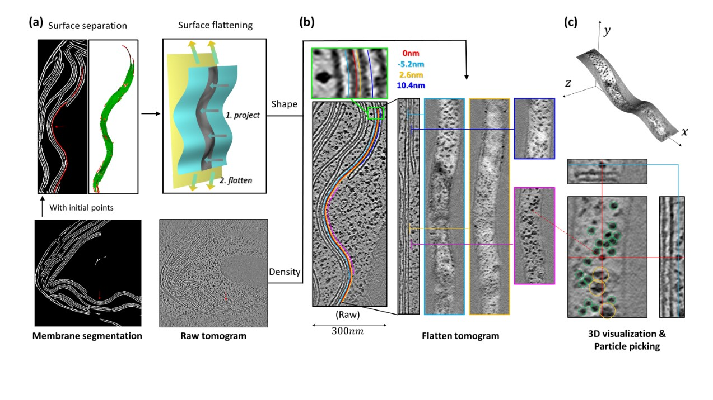

# Overview

## What is MPicker?

**MPicker** is a software designed for flattening curved membranes in cryoET. It facilitates the generation of a new flattened tomogram for each membrane, allowing for easy **visualization and picking of membrane proteins**. The software provides the option to label membrane protein orientations in flattened tomograms. With this feature, you can bypass the need for a global search in subtomo averaging. While theoretically unnecessary, a well-executed membrane segmentation significantly enhances efficiency and output quality. MPicker also offers a small pretrained deep learning model for automatic segmentation.

MPicker is implemented in Python and has a user-friendly graphical user interface (GUI), ensuring compatibility across platforms. The flattened tomograms produced are stored as mrc files, providing flexibility for subsequent analysis. The software includes functionality for converting coordinates and orientations between the flattened tomogram and the original tomogram.

See our [Installation](https://thuem.net/software/mpicker/installation.html) and [Tutorial](https://thuem.net/software/mpicker/tutorial.html) for details.

## About this guide

his user guide includes all instructions you may need for downloading, installing, and using this software. A tutorial is also provided to help you get started. If any questions or bugs, please contact the team through email: thuem2018@126.com.