# Tutorial

## Overview

Welcome to MPicker! To install the software, refer to the **Installation** and **Download** pages. For detailed information about the GUI, consult the **Manual** page. Explore the **Advanced Tutorial** for tasks such as flattening complex surfaces in mesh, automatic particle picking, and Class2D. Before exploring other tutorial sections, make sure to finish the **basic usage** part.

## Basic usage

This tutorial guides through the process of flattening membranes in the cyanobacterium Anabaena. Download the tutorial file `MPicker_tutorial_v1.0.0.tar.bz2` to a directory of choice and extract it:

```bash
tar -jxvf MPicker_tutorial_v1.0.0.tar.bz2
cd tutorial
```

The tutorial includes three files:

- `emd13771_isonet.mrc`: CryoET data from EMD-13771, processed by isonet and cropped to a small size.
- `seg_post_id0_thres_0.60_gauss_0.50_voxel_150.mrc`: Membrane segmentation of `emd13771_isonet.mrc`. This can also be generated using MPicker.
- `manual_surf.txt`: Manually picked points used to label a membrane, demonstrating how to flatten a membrane without segmentation.

### Load the data

Activate the conda environment and ensure that `mpicker/mpicker_gui` is in the `$PATH`. Open MPicker:

```bash
Mpicker_gui.py &
```

Press `Open Raw` and select `emd13771_isonet.mrc` to load it. Use mouse actions to navigate (drag to move, mouse wheel to zoom), and adjust image contrast via the spinbox of Bright and Contrast. Display xy slices at different z positions by scrolling the mouse wheel over the spinbox of z or dragging the bar.

Press `Save Path` and choose a folder to save the result (e.g., the current path `xxx/tutorial`). MPicker will create a folder `xxx/tutorial/emd13771_isonet` to save the result for this tomogram, and a file `xxx/tutorial/emd13771_isonet.config` for reloading the project later.

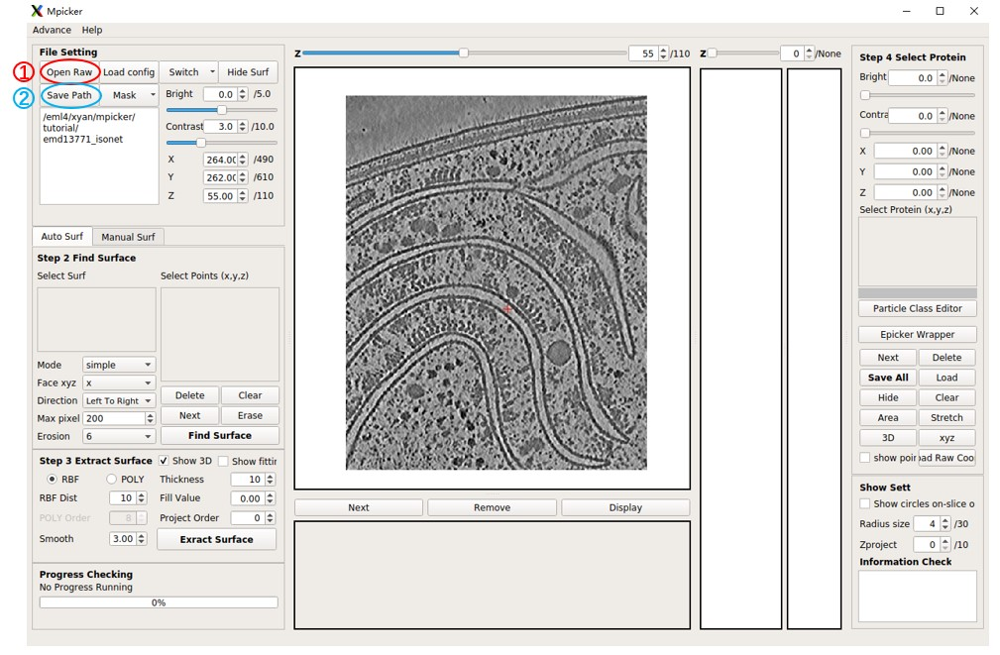

### Load membrane segmentation

While a segmentation is provided, it can also be generated in MPicker. Refer to the **Generate membrane segmentation** section for details.

Press `Mask`, select `Open Mask`, and choose the segmentation file `seg_post_id0_thres_0.60_gauss_0.50_voxel_150.mrc`.

MPicker will load it and calculate its boundary, which may take some time. It will generate a new file `tutorial/emd13771_isonet/my_boundary_6.mrc`.

Toggle between the raw tomogram, segmentation, or boundary by pressing `Switch` and choosing Raw, Mask, or Boundary. The boundary is the essential component for subsequent tasks, serving as the point cloud representation of the entire surface.

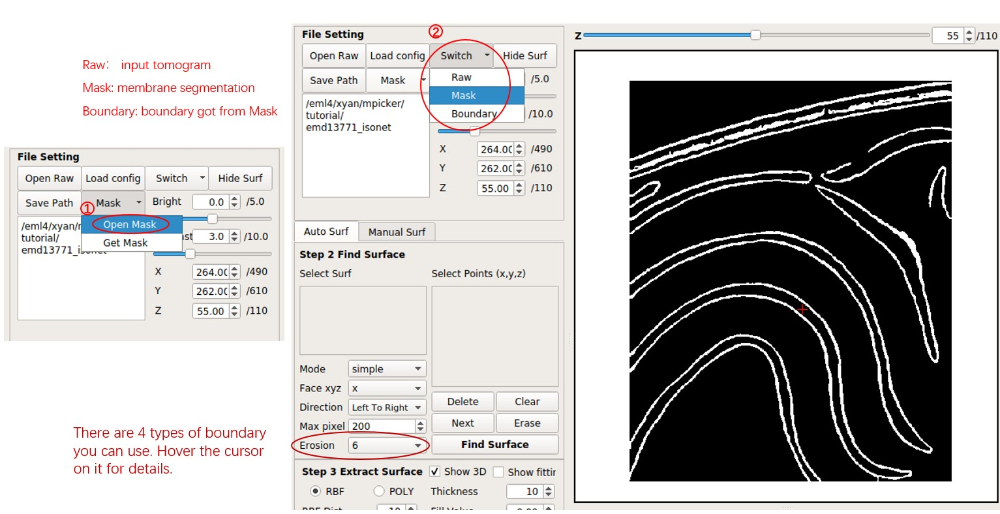

### Separate a Surface

Move the red cross to a point near the membrane surface by left-clicking it. Then press `Shift + S` or right-click and choose `Save as Reference`. The point will be added to the `Select Points` list, marked by green arrows. Press `Find Surface` to separate the surface near the point.

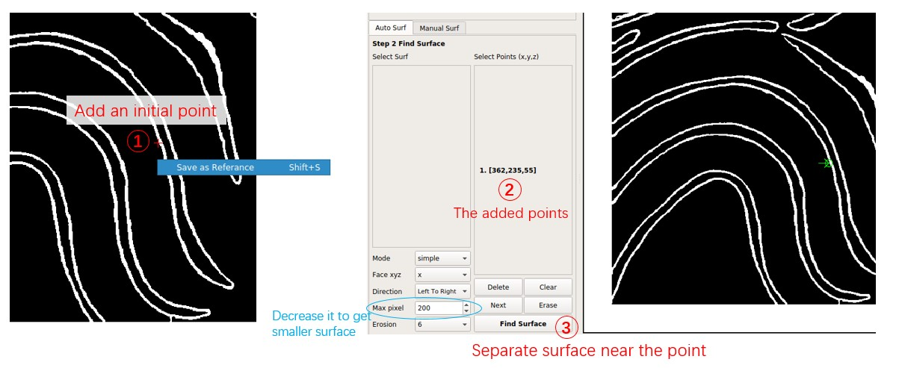

Now the first separated surface is shown in orange. The orange line ends at the top because the `Face xyz` of the point is `x`, indicating that it separates the surface perpendicular to the x-axis, or the surface can be represented as `x = f(y,z)`.

To add the top region to the surface, add another point based on the first surface. Click near the membrane surface on the top region, press `Shift + S` as before, and change `Face xyz` to `y`. Each point can have different `Face xyz` and `Direction`, determining where the line extends when facing forks. Press `Find Surface` to separate the second surface.

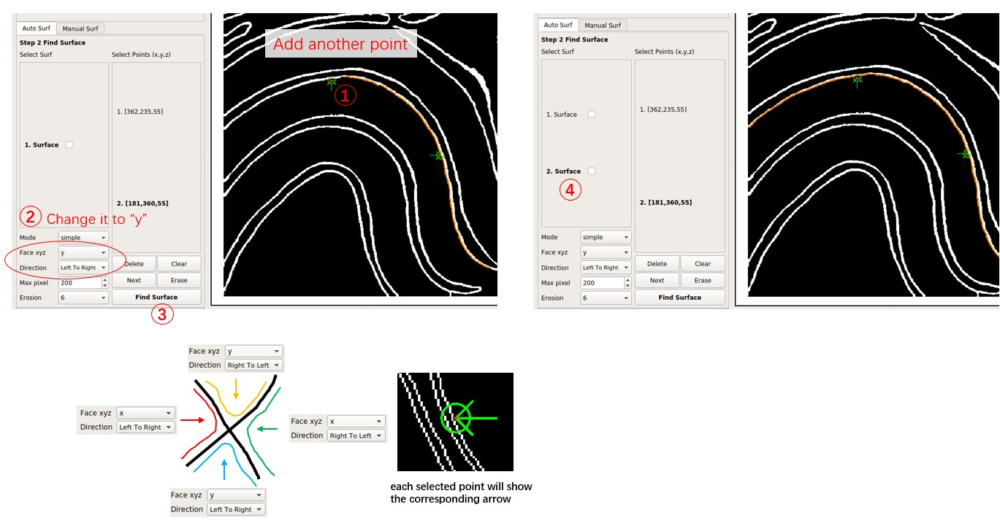

Note that the `Select Points` list of the surface in the `Select Surf` list will be fixed. Add new points based on the selected surface and press `Find Surface` to get a new surface. **Remember to** press `Clear` before adding points for a completely new surface. To delete the selected point, press `Delete`.

Switch between different surfaces by clicking them in the `Select Surf` list, and delete them by right-clicking and choosing `Delete Selected`.

For a boundary with low quality, indicating many forks and discontinuities, it is advisable to decrease `Max pixel` and choose more points at different places on the membrane surface.

### Flatten a Surface

Select the second surface by clicking `2. Surface`. Change `Project Order` to `4`, indicating MPicker will project it onto a fourth-order polynomial cylinder. Increase `thick` for a thicker flattened tomogram.

Press `Extract Surface` to flatten the membrane; this process takes about 5 seconds. A flattened tomogram labeled `2-1` will be obtained. Select it by clicking, then press `Display` to view the flattened tomogram on the right side.

Check `Show 3D` and `Show fitting` to observe the intermediate process in 3D. Note that viewing it remotely, for example, through an SSH connection, may limit visibility due to OpenGL reasons, but it won't affect the result.

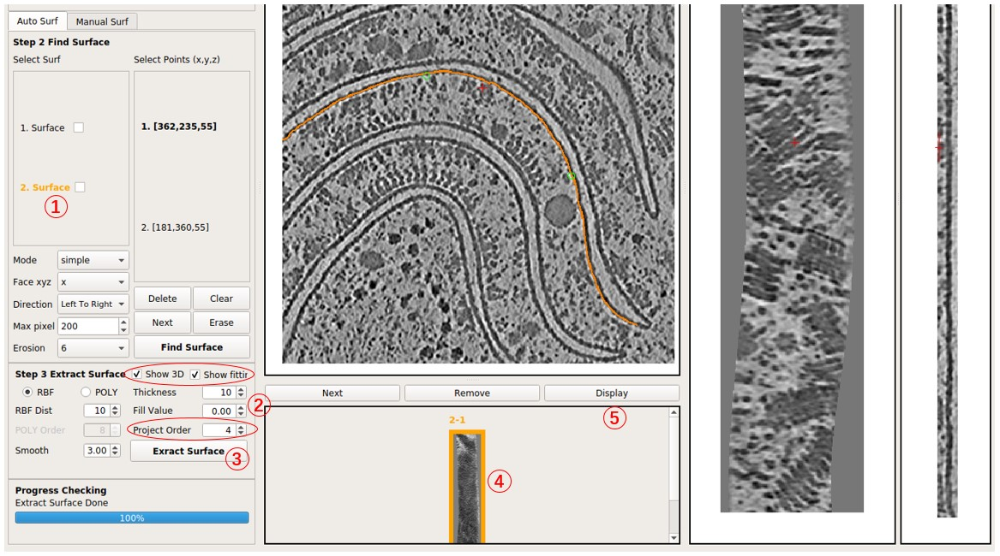
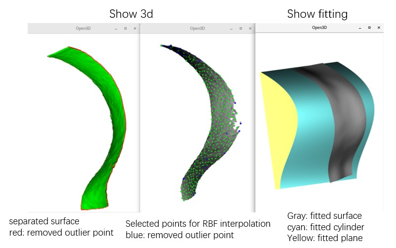

Modify parameters and press `Extract Surface` again to obtain another flattened tomogram of this surface, for example, `2-2`. Experiment by changing `Project Order` to `1` to observe the result of projecting it onto a plane rather than a cylinder. In general, increasing `Project Order` may solve issues if the result appears strange.

### Check the Result

Examine the flattened tomogram on the right side. Adjust the image contrast using the Bright and Contrast spinbox. Move the red cross by left-clicking on the image, adjusting the spinbox of xyz coordinates, or pressing arrow keys. Note that the red cross on the left side (raw tomogram) will move correspondingly. These two crosses indicate the same location.

The main GUI will display XY and YZ slices. View both XY, YZ, and XZ slices and project multiple slices in a new window by pressing `xyz`. To assess the distortion caused by flattening, press `Area` or `Stretch`. To view XY slices in 3D space (without distortion), press `3D`.

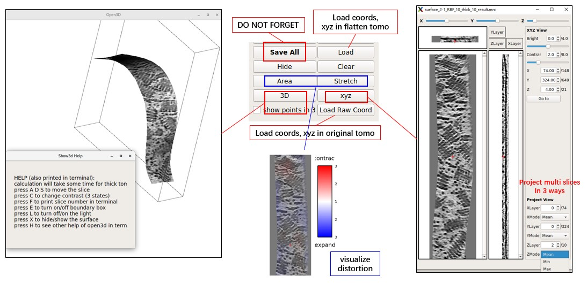
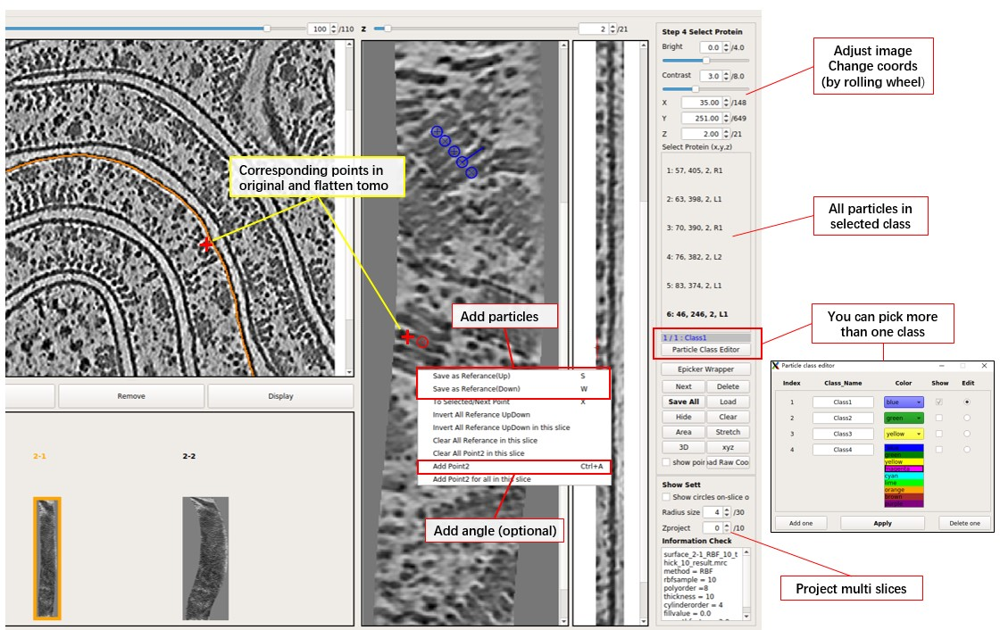

### Output Files of MPicker

MPicker should generate some files and folders as shown below. The most important ones are `emd13771_isonet.config`, `emd13771_isonet/*/*_result.mrc`, and `emd13771_isonet/*/*_InterpCoords.txt`. Others can be ignored for now for non-advanced users.

```
--tutorial
  -- emd13771_isonet.config
  -- emd13771_isonet
    -- my_boundary6.mrc
    -- surface_1_emd13771_isonet 
      ...
    -- surface_2_emd13771_isonet
      -- surface_2.config
      -- surface_2_surf.mrc.npz
      -- surface_2-1.config
      -- surface_2-1_RBF_10_thick_10_convert_coord.npy
      -- surface_2-1_RBF_10_thick_10_result.mrc
      -- surface_2-1_RBF_10_thick_10_SelectPoints.txt
      -- surface_2-1_RBF_InterpCoords.txt
      ...
    -- manual_1_emd13771_isonet
      -- manual_1.config
      -- manual_1_surf.txt
      -- manual_1-1.config
      -- manual_1-1_RBF_10_thick_10_convert_coord.npy
      -- manual_1-1_RBF_10_thick_10_result.mrc
      -- manual_1-1_RBF_10_thick_10_SelectPoints.txt
      -- manual_1-1_RBF_InterpCoords.txt
    -- memseg
        -- seg_raw_id0.mrc
        -- seg_post_id0_thres_0.60_gauss_0.50_voxel_150.mrc
        ...
```

- `emd13771_isonet` is the folder that contains all results of MPicker.
- `emd13771_isonet.config` is used to reload the result. Continue working in MPicker next time with:
  ```bash
  Mpicker_gui.py --config path_to/emd13771_isonet.config &
  ```
  The config file can also be loaded by pressing `Load Config` after opening the GUI. The config file saves the absolute path of the input tomogram, membrane segmentation, and boundary file. If the result folder and config file are relocated, ensure that they remain in the same directory. Also, remember to update the file paths in the config file, including the path for my_boundary6.mrc.

- `my_boundaryxxx.mrc` is the boundary file calculated from segmentation. MPicker calculates it because a membrane is thick. By using only one of the two boundary surfaces of a membrane, MPicker can flatten the membrane with higher accuracy.

- Each separated surface will have its folder, such as `surface_2_emd13771_isonet`, which is the folder of **2.Surface**. The file `surface_2.config` records parameters MPicker used to separate it from the boundary. `surface_2_surf.mrc.npz` is the separated surface, and conversion between .npz file and .mrc file can be done by the script `Mpicker_convert_mrc.py`. MPicker converts .mrc to .npz to save space.

- Each separated surface can be flattened into more than one flattened tomogram, such as `2-1`, `2-2`. They are all saved in one folder. The `.config` file records the parameters used to flatten. The `_result.mrc` file is the flattened tomogram itself. The `_convert_coord.npy` file records the relationship of coordinates between the flattened tomogram and the original tomogram. If x, y, z in the flattened tomogram correspond to Rx, Ry, Rz in the original tomogram, and they start from 0, then Rx, Ry, Rz can be obtained by `Rz, Ry, Rx = numpy.load("xxx.npy")[:, z, y, x]`. The `_InterpCoords.txt` file records the points MPicker finally used for RBF interpolation, and more points can be used by decreasing `RBF Dist` and vice versa. The `_SelectPoints.txt` file records all information of particles picked in the flattened tomogram. See **Particle Picking by Hand** for details.

- If surfaces are separated by manually labeled points, see **Flatten Membrane Without Segmentation** for details, then each surface will also have its folder, such as `manual_1_emd13771_isonet`. It doesn't have a `.mrc.npz` file because it is not from segmentation, but it has a file to record manually labeled points such as `manual_1_surf.txt`. Other files are the same as those in the surface separated from segmentation.

- If membrane segmentation is done in MPicker, see **Generate Membrane Segmentation** for details, then a folder `memseg` will be created, which saves all results of segmentation. Note that `seg_raw_id0.mrc` cannot be used as the `Mask` because it is not a binary segmentation (with only 0 or 1 as its value).

## Particle Picking by Hand

Now particles can be manually picked in the flattened tomogram. Position the red cross by left-clicking and press `S` to save the position (or right-click and select `Save as Reference`). Note that there is a distinction between Up (`S`) and Down (`W`), but it can be ignored (just press `S`) if particle orientation is not a concern. Refer to the image below for a more intuitive understanding.

**Remember** to press `Save All` before quitting or displaying another flattened tomogram.

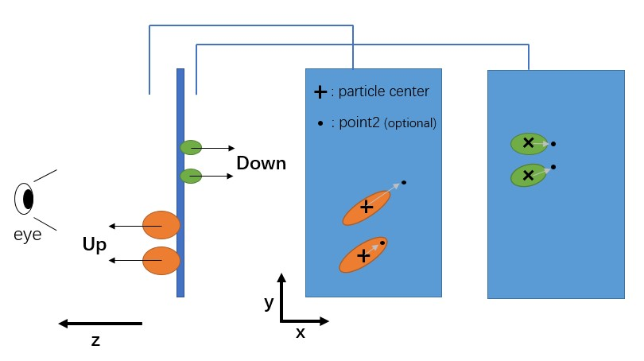

MPicker will record the corresponding membrane normal vector for each picked particle, but the normal vector can have two options, Up or Down, depending on which side of the membrane the particle is on.

A position can also be added as "point2" for a selected particle, enabling complete determination of the particle's orientation (grey arrow as the x-axis and the norm vector as the z-axis). To add point2 for a particle, move to the same xy slice as the selected particle, position the red cross, and press `Ctrl+A` (or right-click and press `Add Point2`).

To select a picked particle, double-click on a particle in the xy slice, and its circle will turn red. Ensure that the center of the circle is on this xy slice (cross is displayed). A particle can also be selected by clicking on the ones listed on the right side.

Particles can also be picked in the flattened tomogram (a file ending with `_result.mrc`) using other software if preferred. To load the result into MPicker, simply load the coordinate file (a txt file with 3 columns as x y z, starting from 1) by pressing `Load`. If particles are already picked in the original tomogram, load the coordinates by pressing `Load Raw Coord` and check them in the flattened tomogram. Particles outside of the flattened tomogram will be ignored. Coordinate conversion between the original and flattened tomogram can also be performed using the script `Mpicker_convert_coord.py`.

More than one class of particle can be picked together. Press `Particle Class Editor`, and then press `Add one` to add a new class. Select which class to edit (pick particles) and which classes to display. Then press `Apply` to use it. The color and name for each class can be changed, but MPicker will only save the **index** into `_SelectPoints.txt`. Note that pressing `Delete one` will not delete the data of particles; it only controls the display. For example, if some particles are picked in Class2 and then the Class2 is deleted, the gui will display `1/2: Class1`, `2` means the particle in the saved data with the highest index is 2. They can be seen again if class2 is added back.

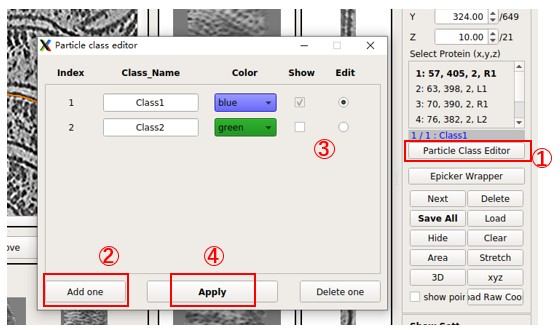

The information of picked particles for each flattened tomogram is saved in files ending with `_SelectPoints.txt`. For surface `2-1`, it is `tutorial/emd13771_isonet/surface_2_emd13771_isonet/surface_2-1_RBF_10_thick_10_SelectPoints.txt`. Below is what it looks like.

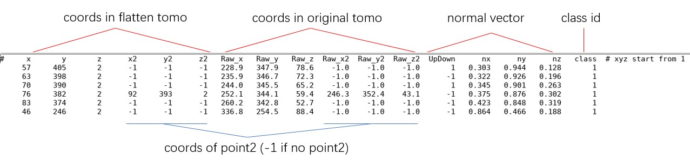

All `_SelectPoints.txt` of one tomogram can be merged and converted into Euler angles using the script `Mpicker_particles.py`. For example:

```bash
Mpicker_particles.py --input emd13771_isonet --out_mer merge.txt --out_ang angle.txt
```

It will merge all `_SelectPoints.txt` files in the result folder `emd13771_isonet` into `merge.txt` and then convert it to `angle.txt`. Below is what `angle.txt` looks like. `X` `Y` `Z` are the coordinates of particles in the original tomogram, and the definition of `rot` `tilt` `psi` is the same as `rlnAngleRot` `rlnAngleTilt` `rlnAnglePsi` in Relion.

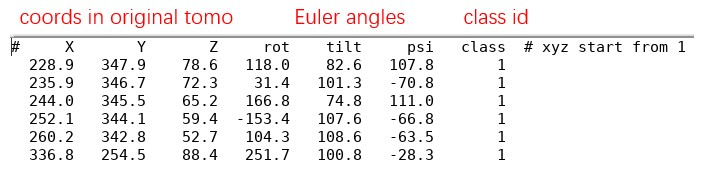

**Note: Normal vectors can only decide `tilt` and `psi`**, so the `rot` of particles without point2 will be filled with a random angle. The `rot` of all particles without point2 can also be set to `0` by adding `--fill_rot 0`. Type `Mpicker_particles.py -h` for details. Note that `UpDown` can be `1` (Up) or `-1` (Down), so the real normal vectors should be `UpDown * (nx, ny, nz)`.

## Generate Membrane Segmentation

This step can be skipped if a segmentation is already available. To run membrane segmentation, ensure the computer has at least one GPU, and the full version of MPicker is installed (see installation instructions for details).

First, press `Mask` and choose `Get Mask`, and MPicker will open a new window.

Next, press `Run` in the left half of the window. (Change GPU id to `0,1` and adjust batch size and threads to `4` if there are 2 GPUs.)
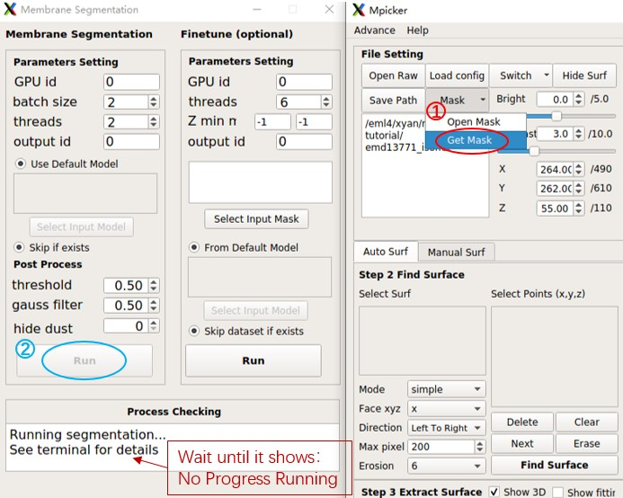

Wait until it finishes. This process takes about 4 minutes (one GeForce RTX 2080 Ti was used here). The terminal will display something like this:
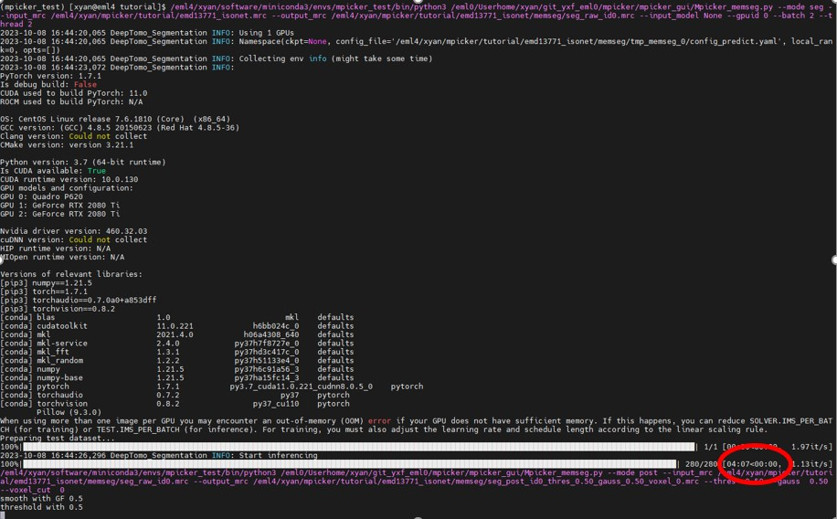

The results will be stored in `xxx/tutorial/emd13771_isonet/memseg`:

- seg_raw_id0.mrc: raw segmentation from neural network, continuous map, ranging from 0 to 1
- seg_post_id0_thres_0.50_gauss_0.50_voxel_0.mrc: result of post-process, binary mask, 0 or 1, takes much less time than raw seg

Verify the results using 3dmod or other preferred software. The result of post-process (binary mask) is what is needed. Adjust parameters of post-process if necessary. Here, `threshold` was increased to `0.6` to remove weak signals and `hide dust` was changed to `150` to eliminate small connected components.

Then press `Run` on the left side again. A new result will be obtained soon, as it only performs post-processing this time. It will generate a new file `seg_post_id0_thres_0.60_gauss_0.50_voxel_150.mrc`, which should be similar to the segmentation contained in the tutorial folder.
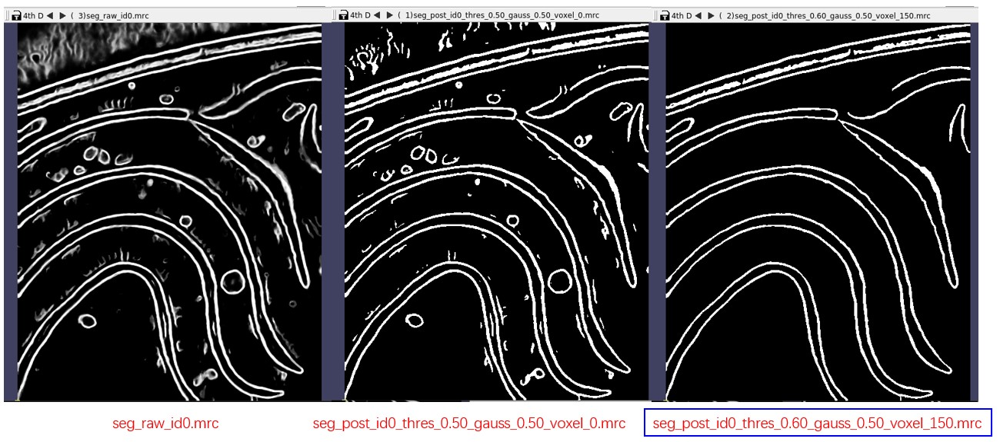 

Now, close the segmentation window and return to the main window.

## Flatten Membrane Without Segmentation

In case a suitable segmentation is not available, **Load Membrane Segmentation** and **Separate a Surface** can be skipped by labeling membranes by hand.

Select the tab `Manual Surf` instead of `Auto surf`, then press `Load` to load the coordinate file `manual_surf.txt`, which contains 29 manually labeled membrane positions. Labels can also be added manually. Similar to what was done in **Separate a Surface**, move the red cross to a point on the membrane by left-clicking it, then press `Shift + S` or right-click and choose `Save as Reference` to save it. Then, it will be added to the `Select Points` list. The added points are indicated by green circles. Press `Save New` to save these points as a new surface.

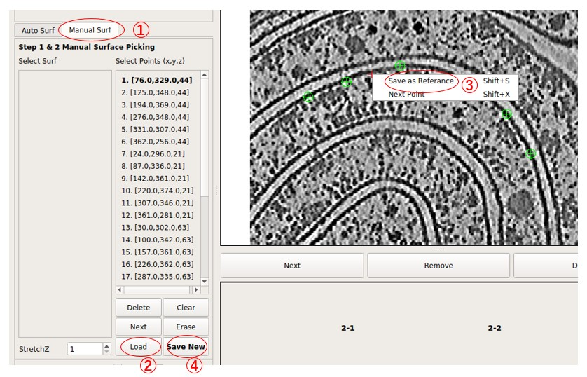

Next, press `Extract Surface` to flatten the membrane, and a flattened tomogram called `M1-1` will be obtained. Select it by clicking it. Then, press `Display` to view the flattened tomogram on the right side. The membrane is not as flattened as in surface `2-1` because the number of points is much less than what was used in surface `2-1`. However, it is sufficient to visualize large membrane proteins. More points can be added to improve the result.

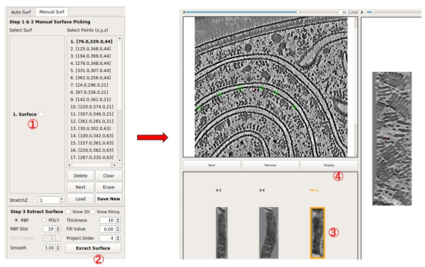

In general, `RBF Dist` can be decreased to `1` in this mode to preserve all points added. It decides the minimal distance (in pixels) between points used at last. Also, `Project Order` should not be high if the number of points is small. 

To see which points were used for surface `2-1` (separated from segmentation), press `Clear` to clear current points, and then press `Load` to load file `emd13771_isonet/surface_2_emd13771_isonet/surface_2-1_RBF_InterpCoords.txt`, which should contain about 305 points.