# Advanced Tutorial

## Automatic Particle Picking and Class2D

In this tutorial, the process of flattening thylakoid membranes of Chlamydomonas and automatically picking proteins on it using [EPicker](http://thuem.net/software/epicker/installation.html) will be demonstrated. Additionally, obtaining projections of proteins along the membrane's norm vector and corresponding "2dCTF" will be covered. While the calculation of Class2D is beyond the scope of this tutorial, converting the Class2D result into Euler angles will be shown. For Class2D, [Thunder2](http://thuem.net/software/thunder) was used.

MPicker includes a wrapper for EPicker, but EPicker must be installed and added to the PATH first. Ensure a GPU with CUDA support is available to run EPicker.

[Relion2](https://github.com/3dem/relion/tree/ver2.1) can also be used for Class2D, but download the modified version [here](http://thuem.net/website/MPicker/Others/relion2_2dctf.tar.gz) to support 2dCTF images. Notice that the MPI must be 1, but threads can be larger than 1, and GPU usage is supported.

- ### About Tutorial File

Download the tutorial file `MPicker_tutorial_pick_v1.2.0.tar.bz2` and extract it:
```bash
tar -jxvf MPicker_tutorial_pick_v1.2.0.tar.bz2
cd tutorial_pick
```

The files/folders in the tutorial_pick directory are:

- `cc1691_isonet/`: Result folder of MPicker
- `cc1691_isonet.config`: Config file used to reload the work
- `cc1691_isonet.mrc`: CryoET data of Chlamydomonas' chloroplast, processed by isonet and cropped to a small size
- `cc1691_mask.mrc`: Membrane segmentation of cc1691_isonet.mrc
- `pick_batch.txt`: A file used for picking particles in many flattened tomograms without the GUI
- `model_epicker.pth`: A pretrained model for EPicker
- `trainset_id1/`: The trainset we used to get the model above
- `class2d/`: Some demo data to show how to get 2D particles and how to convert results from Class2D
- `cmd.txt`: It summarizes the commands you will use.

Relative paths are used in the config file for convenience (MPicker typically uses absolute paths). So, **run `Mpicker_gui.py` under the folder `tutorial_pick`** or change the three paths in the config file to the real absolute path.

- ### Flatten Surfaces

First, load the job by running:
```bash
Mpicker_gui.py --config cc1691_isonet.config &
```

Seven surfaces have already been identified and one of them flattened. Select flattened tomogram `2-1` and press `Display`. Check the parameters used to flatten it, and flatten other surfaces with the same parameters. Skip surface1 because it is nearly the same as surface2, just using different `Erosion`. Right-click and press `Show All` to display all surfaces.

`Erosion 18` is used here, which means performing binary_dilation at first because the segmentation here is too thin. The Erosion of surface1 is 6 (default). Check the difference between them by switching to boundary mode.

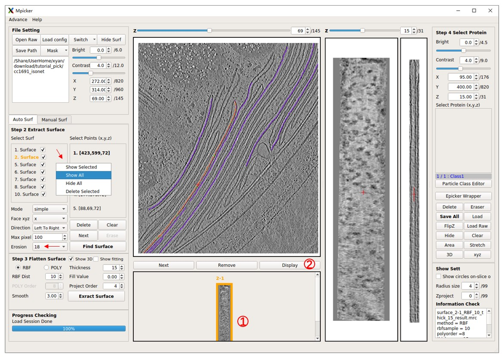

- ### Pick particles with EPicker

`Display` flattened tomogram `2-1`, then press `EPicker Wrapper`, and a new window will open. Specify the path to the EPicker executable file using the `epicker` field; use `epicker.sh` (default) if EPicker is added to the PATH. The `edge xy` option ignores particles near the edge of the flattened tomogram. A lower `threshold` results in more particles, `max num` sets the maximum allowed number of particles to pick, and `min dist` is the minimum allowed distance (in pixels) between two picked particles. `GPU id` sets which GPU to use. EPicker can only use 1 GPU for picking (can use multiple GPUs when training). The result (x y z score) will be saved in a file under the same folder as the flattened tomogram, for example, `cc1691_isonet/surface_2_cc1691_isonet/surface_2-1_RBF_10_thick_15_epickerCoord_id0.txt`. The new result with the same `output id` will overwrite the old one. Output files can be ignored because the result can be loaded directly into the MPicker GUI by choosing `load result to gui`.

The `z range` is crucial as it determines which slices of the flattened tomogram will be picked (note that EPicker is a software for 2D particle picking). Specify a range like `10,11,12` or `10,11-12` or `10-12`, all meaning the same thing. Choose slices where the density of particles is clear. For flattened tomogram `2-1`, use `14,15`. Press `Select Input Model` and load the provided `model_epicker.pth` if it is empty. It's recommended to train a new model for your specific protein (training details will be discussed later).

Now press `Pick` to run EPicker. Wait until `Process Checking` says `No Progress Running`. Clear existing particles if there are any. Note that `pad to square with size` is set to `1200`, meaning that each slice will be pad to a square with a size of 1200 pixels. Because for old EPicker version (like 1.1.2), too small or un-squared image may cause problems. This value should remain the same when picking and training, and should be larger than the largest flattened tomogram.

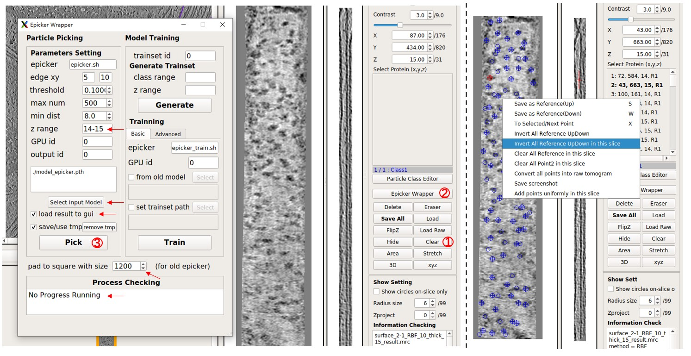

Now, observe the picking result in MPicker's GUI. Edit the result (see **Particle picking by hand** in the basic tutorial for details). Press `Save All` to save the result. The loaded particles are `UP` by default, but the particles here in `2-1` should be `Down`. Right-click on the flattened tomogram and press `Invert All Reference UpDown`. Ignore it if only coordinates, not orientations, are needed.

- ### Pick particles in command line for multiple flattened tomograms

Pick particles in other flattened tomograms similarly, adjusting the `z range` and UpDown. It may take about 10s for picking a flattened tomogram, but most of the time is spent on loading the model. Another way to pick particles in many tomograms with the same parameters is by using the script `Mpicker_epicker_batch.py`. The input file should contain the path of flattened tomograms, and their `z range` as the second column. Results will be saved in one folder, and the result can be added directly into the corresponding `_SelectPoints.txt` file. The third column is optional and can be 1 or -1, determining the UpDown when adding the result into the `_SelectPoints.txt` file (1 means Up, -1 means Down). The z axis of a flattened tomogram can also be inverted after flattening, by pressing `FlipZ` (flipx+flipz in fact), but here it is assumed that this was not done.

Check the provided file `pick_batch.txt`. Now, close MPicker's GUI and run:

```bash
Mpicker_epicker_batch.py --model model_epicker.pth --fin pick_batch.txt --out out_result --add_cls 2 --overwrite \
--dist 6 --pad 1200 #--save_tmp 0
```

Set other parameters such as `--thres`, `--gpuid`; here default values are used. The result will be saved in the `out_result` folder. Ignore it because the results are already saved in the `_SelectPoints.txt` file, and their class ID is set as 2. `--overwrite` means the particles saved as class 2 before will be cleared first.

Add `--save_tmp 0`, which has the same function as the `save/use tmp file` in GUI. It will pick all slices and record all possible particles in the "tmp file" (with the id 0), so that the result can be quickly obtained when adjusting the parameters like `threshold` or `z range` (except for `max num`), without re-running the EPicker, but it will cost more time.

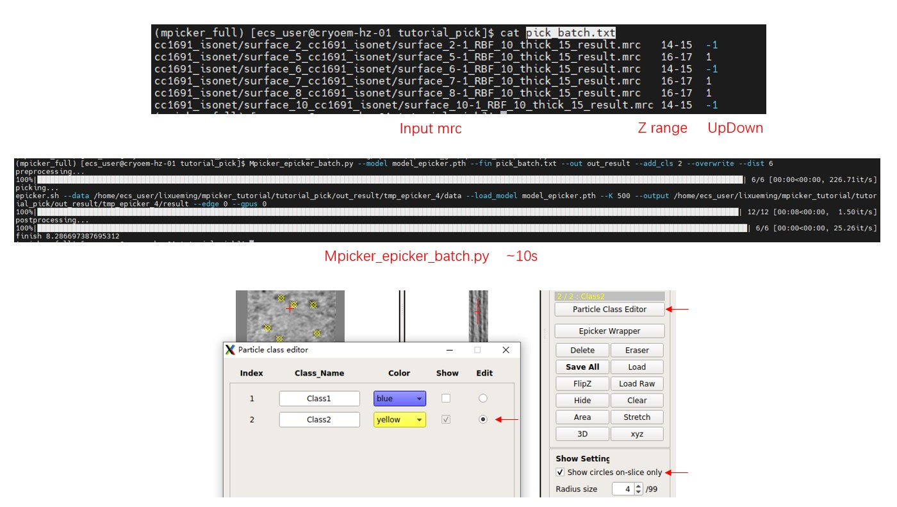

Open MPicker again with `Mpicker_gui.py --config cc1691_isonet.config &` and check the result. Display one flattened tomogram, press `Particle Class Editor` and let it display class 2 (see **Particle picking by hand** in the **Tutorial** for details). Then check the results of automatic picking. Check `Show circles on-slice only` to display particles just located on this slice (z). `Radius size` is the radius of the sphere when displaying particles. `Zproject` will project multiple z slices (0 means 1 slice, 1 means 3 slices), which is also provided in the `xyz` window.

- ### Train a model for EPicker

To train a model for EPicker, follow these steps:

**1. Generate Trainset**

For each flattened tomogram, pick the particles and press `Save All`. Then, select the suitable `class range` and `z range` in the EPicker wrapper and press `Generate` to save the labels into the trainset folder. Here, the `trainset id` is `0`, so all labels will be saved in `cc1691_isonet/epicker/trainset_id0/`.

Note: EPicker processes 2D images, so the tomogram is separated into many slices, and 3D coordinates are transformed into many 2D coordinates. Each slice is saved as a xxx.mrcs file, and its 2D coordinates are saved as a xxx.thi file. If a protein is visible in more than one slice, label it in each relevant slice. By default, it uses all slices with particles (EPicker does not support negative examples) and all classes. Adjust them using `class range` and `z range`.

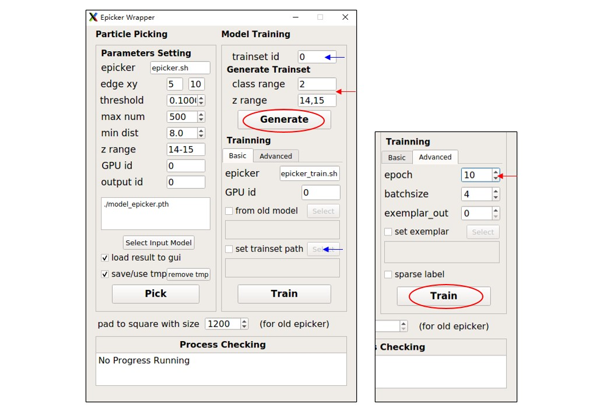

**2. Train the Model**

After generating image-coordinates pairs for each flattened tomogram, train the model from the trainset. It's recommended to use at least 8 slices for training. To save time, set `epoch` (in the `Advanced` tab) to `10` as a test. Press `Train` to start training and wait until `Process Checking` says `No Progress Running`. The resulting model will be saved as `cc1691_isonet/epicker/trainset_id0_bs4_result/model_last.pth`. The `batchsize` parameter influences the result, so just use `4` here. Finetune from an old model or set exemplar (continual training) is also available. See [EPicker](http://thuem.net/software/epicker/installation.html) for details. The trainset folder can also be specified using `set trainset path`. In fact, `model_epicker.pth` is trained from `trainset_id1/` with `batchsize 4` and `epoch 120`.

- ### Get Input Files for Class2D

To begin, merge results from all flattened tomograms using `Mpicker_particles.py` and convert them to real coordinates and Euler angles (see **Particle Picking by Hand** in the **Tutorial** for details). Here, `class2d/merge_data.txt` will be used for demonstration purposes, because it contains more particles.

In practice, four tomograms (5000+ particles) were processed and Class2D was performed in Thunder2, using bin2 WBP tomograms to extract 2D particles. However, only a portion of the data is selected here for demonstration, and the tomogram used here is a bin3 tomogram (pixel size 10.89 Å) processed by isonet. Don't forget to consider the coordinate conversion if the tomograms used for picking and used for extracting have different bins.

Now, generate a coarse 3dCTF file, `3dctf_cc1691.mrc`, with a box size of 50:

```bash
cd class2d/
Mpicker_3dctf.py --df 58381 --pix 10.89 --box 50 --out 3dctf_cc1691.mrc --t1 -58.36 --t2 55.07
```

An average defocus (in Å) is used and t1 and t2 are set using the first and the last angles in the .tlt file. Other parameters can be checked by `Mpicker_3dctf.py -h`.

Now, obtain particle projections `2d_output.mrcs` from the tomogram and 2dCTFs `2dctf_output.mrcs` from 3dCTF:

```bash
Mpicker_2dprojection_torch.py --map ../cc1691_isonet.mrc --data merge_data.txt --dxy 50 --dz 5 \
--ctf 3dctf_cc1691.mrc --invert --output 2d_output.mrcs --ctfout 2dctf_output.mrcs \
--thu 2d_output.thu --tomoout tomoout.mrc --gpuid 0
```

If the environment does not have PyTorch (for example, if using MPicker_noseg version), replace `Mpicker_2dprojection_torch.py` with `Mpicker_2dprojection.py` and delete `--gpuid 0`.

The parameters `--dxy 50 --dz 5` mean extracting a box with a size of 50 \* 50 \* 5 pixels, using particle coordinates as the center and norm vectors as the z-axis for each particle. Then, project the box along the z-axis to obtain the final projection image. Therefore, each output 2D particle and its 2dCTF have a size of 50 \* 50. This is why the box size of 3dCTF is set as 50. `--dz 5` is used because proteins here are thin, and only the region outside the membrane is needed. `--thu 2d_output.thu` generates the input `.thu` file for Thunder2 (set `--star xx.star` to generate a star file for Relion). `--invert` means inverting the contrast of output images. Note that, here a tomogram processed by isonet is used, so the missing wedge of the projection is not distinct. `--tomoout` is optional, and will output a naive sub-tomogram averaging (just rotate, no CTF considered).

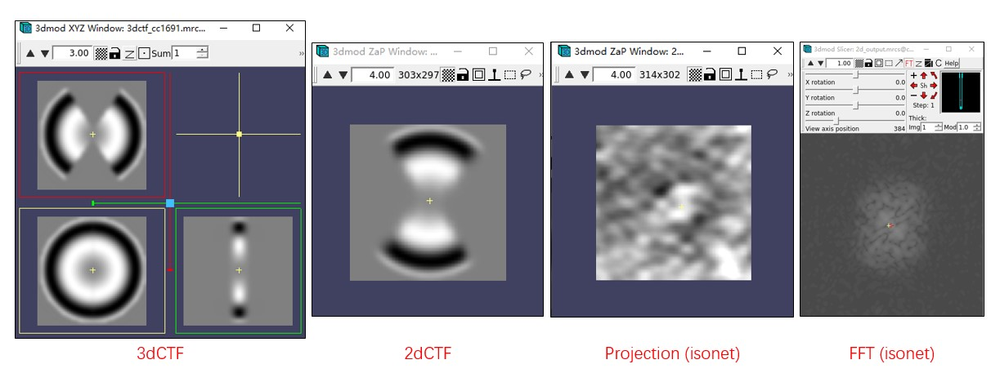

For running Class2D in Thunder2, `2d_output.mrcs`, `2dctf_output.mrcs`, and `2d_output.thu` are the required files. Additionally, `merge_data.txt` is needed to convert the result of Class2D back.

If there are multiple tomograms, run these commands for each tomogram (with different output names), and merge all .thu files together by hand (or set `--conti` to write all content in one file).

- ### Process the Result from Class2D

The `Meta_Final_bin3.thu` file contains the results of Class2D, with a total of 10 classes (class id from 0 to 9). The `Reference_Final_bin3.mrcs` file contains the images of each class.

The 6th class (id 5) and the 9th class (id 8) are both good classes, but they are not aligned. A suitable center and rotation angle for each class should be found first. They can be aligned by hand (for example, in the slicer mode of IMOD). A script is also provided to align them automatically:

```bash
Mpicker_align_class2d.py --i Reference_Final_bin3.mrcs --o fmove.txt --mo aligned.mrcs --ids 5,8 --ref 5
```

The command takes class `5` as reference and aligns classes `5,8` to the reference. The align result is saved in `fmove.txt`, and `aligned.mrcs` is the aligned images (optional). By default, the center of reference is the mass center, but it can also be set by `--refxy`.

Then obtain the 3D coordinates and Euler angles from the Class2D result by:
```bash
Mpicker_convert_class2d.py --data link_2d.txt --thu Meta_Final_bin3.thu --fmove fmove.txt --out2 convert_cls58.txt
```

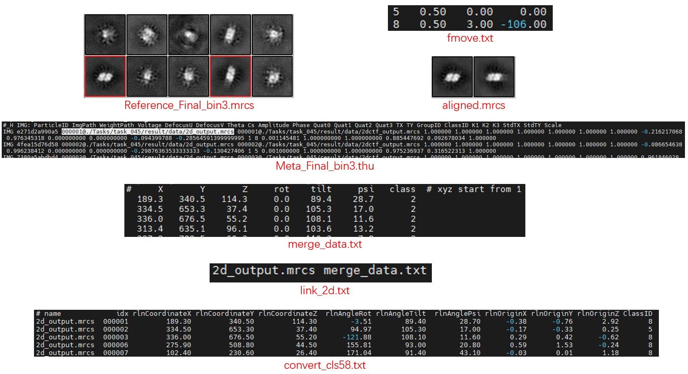

`link_2d.txt` stores the input file for each 2d projection mrcs files, which was used to generate them when running Mpicker_2dprojection. Here particles from only one tomogram are extracted, so there is only one line in `link_2d.txt`. It links the `2d_output.mrcs` and `merge_data.txt` together. If 2d projections for, for example, 10 tomograms are generated, then it should contain 10 lines.

`fmove.txt` is the output of `Mpicker_align_class2d.py`, and it can be written manually if classes are aligned by hand. There should be 4 columns for each class: class_id, shift_x, shift_y, rot_angle.

The result file `convert_cls58.txt` already contains all necessary information. To further simplify the preparation of input files for running STA in Relion2, run:
```bash
Mpicker_prepare_rln2.py --i convert_cls58.txt --link link_tomo.txt --o rln2
``` 
It generates .coords file for each tomogram in the folder `rln2`. It also generates a `particles.star`, which can be used directly for Class3D or Refine3D, after generating 3dCTF and extracting particles following the general workflow of Relion2 (https://www3.mrc-lmb.cam.ac.uk/relion/index.php/Sub-tomogram_averaging). 

If the defocus for each stack is known and stored as a .defocus file for each tomogram, the relion_prepare_subtomograms.py can also be skipped by setting `--prepare_all`. Check `Mpicker_prepare_rln2.py -h` for details.

Relion4 allows coords of all tomograms to be stored in one file. In such case, use `Mpicker_prepare_rln4.py` to generate the file. It can also align the normal vectors to the X axis rather than Z axis, so that the rlnAngleTiltPrior can be 90.

Check the result of conversion. First, extract the coordinates and Euler angles to a file, and then do the 2d projection and sub-volume averaging again:

```bash
awk 'NF>8{print $4,$5,$6,$7,$8,$9}' rln2/particles.star > aligned_data.txt

Mpicker_2dprojection_torch.py --map ../cc1691_isonet.mrc --data aligned_data.txt --dxy 50 --dz 5 \
--invert --output 2d_output_aligned.mrcs --tomoout tomoout_aligned.mrc --gpuid 0

3dmod tomoout_aligned.mrc # or use: Mpicker_check.py tomoout_aligned.mrc &
```

You can see the outline of PSII in `tomoout_aligned.mrc`. It looks fuzzy because a tomogram processed by isonet was used. For `tomoout.mrc`, the extra-membrane region is just a circular disk.

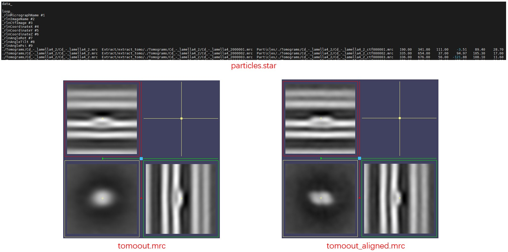

For the raw data of these PSII, refer to [EMPIAR-12469](https://www.ebi.ac.uk/empiar/EMPIAR-12469/).

- ### Prepare STA Files without Class2D

As discussed above, all files required by Relion for STA can be obtained after running the Class2D, like this:

```bash
Mpicker_convert_class2d.py --data link_2d.txt --thu Meta_Final_bin3.thu --fmove fmove.txt --out2 convert_cls58.txt
Mpicker_prepare_rln2.py --i convert_cls58.txt --link link_tomo.txt --o rln2 # For Relion 2 or 3.0
Mpicker_prepare_rln4.py --i convert_cls58.txt --link link_tomo.txt --o rln4.star # For Relion 4 or 5
```

In fact, similar results can be achieved without running the Class2D, but note that the output rlnAngleRot will be incorrect if point2 for particles in GUI was not labeled either. Running Class2d or labeling the point2 in MPicker are two ways to estimate the rlnAngleRot, and surface normal vectors can just decide rlnAngleTilt and rlnAnglePsi. If the rlnAngleRot is not reliable, then it is better not to start from the local angular search when Refine3D.

Anyway, as a simple way to get usable STA files without running Class2D, just run:

```bash
Mpicker_convert_class2d.py --data link.txt --out2 convert.txt
Mpicker_prepare_rln2.py --i convert.txt --o rln2 # For Relion 2 or 3.0
Mpicker_prepare_rln4.py --i convert.txt --o rln4.star --no_prior_rot # For Relion 4 or 5
```

For `Mpicker_convert_class2d.py`, it will skip converting and just merge data when none of --thu, --star, or --fmove are provided. And `link.txt` here can be something like
```
tomo_name1  tomo_data1.txt
tomo_name2  tomo_data2.txt
...
```
Like before, `tomo_data.txt` should be the output of `Mpicker_particles.py` for each tomogram, but here `tomo_name` can be anything, so just let it be the name of tomogram which will be used later in STA. Then for `Mpicker_prepare_rln[24].py`, the --link is not provided here, so it will just use the name in `convert.txt` as the tomogram name. As discussed above, the rlnAngleRot may not be reliable, so `--no_prior_rot` is added here, otherwise `rlnAngleRotPrior` will be added in the `rln4.star`.


## Flatten Surface by Triangle Mesh

This tutorial explains how to flatten a complex surface by representing it as a triangle mesh and performing mesh parameterization. Mesh processing is challenging, and this pipeline (surface reconstruction and parameterization) is not so stable. If you are an expert in the field, you can directly use your surface in obj file (with suitable unnormalized texture coordinates), and MPicker will generate a flattened tomogram for you.

MPicker provides a script to generate a mesh from a point cloud (you can use `.mrc.npz` files in MPicker) using Poisson surface reconstruction in Open3D, if you don't have your own mesh. For details, refer to [this link](http://www.open3d.org/docs/0.11.0/tutorial/geometry/surface_reconstruction.html#Poisson-surface-reconstruction).

MPicker also offers a simple wrapper for [OptCuts](https://github.com/liminchen/OptCuts) to perform mesh parameterization when the mesh lacks suitable texture coordinates. OptCuts can map a 3D surface into a 2D plane (UV unwrapping) with less distortion. Its main advantage is its ability to add seams automatically for complex surfaces. To use OptCuts, you need to install a modified version and add it to your PATH (see [Installation](https://thuem.net/software/mpicker/installation.html#optcuts)).

OptCuts itself may fail on open surfaces with more than one boundary (disk with holes). In such cases, you may want to use `Mpicker_meshparam.py`. To use it, the environment of v1.2 is required, but you can update the old environment as discussed in [Installation](https://thuem.net/software/mpicker/installation.html).

- ### About the Tutorial Files

The files from the basic tutorial can be used as well. Only the `.mrc.npz` file obtained from surface separation is required. However, the provided example here offers a more engaging demonstration.

Firstly, download the tutorial file `MPicker_tutorial_mesh_v1.0.0.tar.bz2` to a location of your choice and extract it:
```bash
tar -jxvf MPicker_tutorial_mesh_v1.0.0.tar.bz2
cd tutorial_mesh
```

The files/folders in `tutorial_mesh` include:

- `emd10409_isonet/`: Result folder of MPicker
- `emd10409_isonet.config`: Config file used to reload the work
- `emd10409_isonet.mrc`: CryoET data of the endoplasmic reticulum (ER) from EMD-10409, processed by isonet, and cropped to a small size
- `emd10409_mask.mrc`: Membrane segmentation of `emd10409_isonet.mrc`
- `useful_files/`: Some demo output and useful files

Here, a surface in the `.mrc.npz` file will be converted to a `.obj` file. Then, texture coordinates will be obtained for the `.obj` file. Finally, MPicker will generate a flattened tomogram based on this file. The commands used are summarized in `useful_files/cmd.txt`.

- ### Check the Surface

Firstly, load the job by executing:
```bash
Mpicker_gui.py --config emd10409_isonet.config &
```

Relative paths are used in the config file here for convenience (MPicker typically uses absolute paths), so **run `Mpicker_gui.py` under the folder `tutorial_mesh`** or change the three paths in the config file to the real absolute path.

A surface has already been separated, and it should be shown in orange. Try flattening the surface using default parameters (projecting on a plane) by pressing `Extract Surface`. A bad result will be obtained where only the top half of the surface can be flattened due to the complexity of the surface.

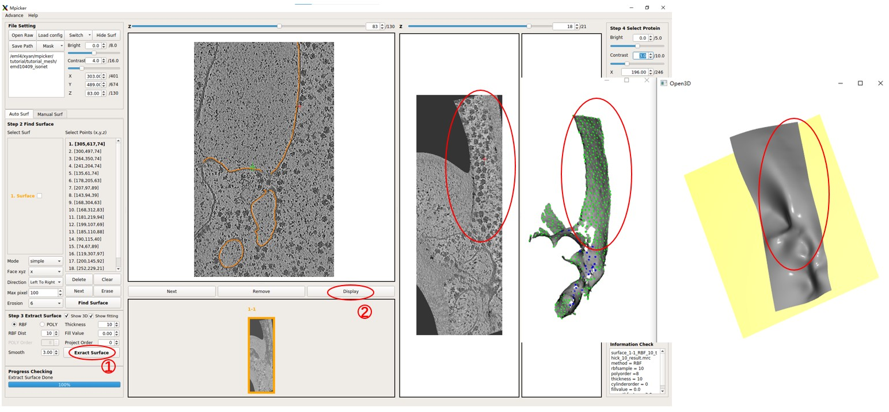

Note that numerous initial points with different `xyz` values were utilized to separate this complex surface because the quality of segmentation is limited.

The `.mrc.npz` file can also be converted into a `.mrc` file, so that the surface can be checked using software like Chimera:
```bash
Mpicker_convert_mrc.py --npz emd10409_isonet/surface_1_emd10409_isonet/surface_1_surf.mrc.npz --out surface_1.mrc
```

Now, close the GUI.

- ### Generate a Mesh

First, convert the `.mrc.npz` file to a `.obj` file using `Mpicker_generatemesh.py`:
```bash
Mpicker_generatemesh.py --fin emd10409_isonet/surface_1_emd10409_isonet/surface_1_surf.mrc.npz --fout surf1.obj # --show_3d
```

The option `--show3d` displays the intermediate process in 3D, as shown below. If not running locally, this visualization may not be seen (due to some OpenGL reasons). Close the window to continue the program.

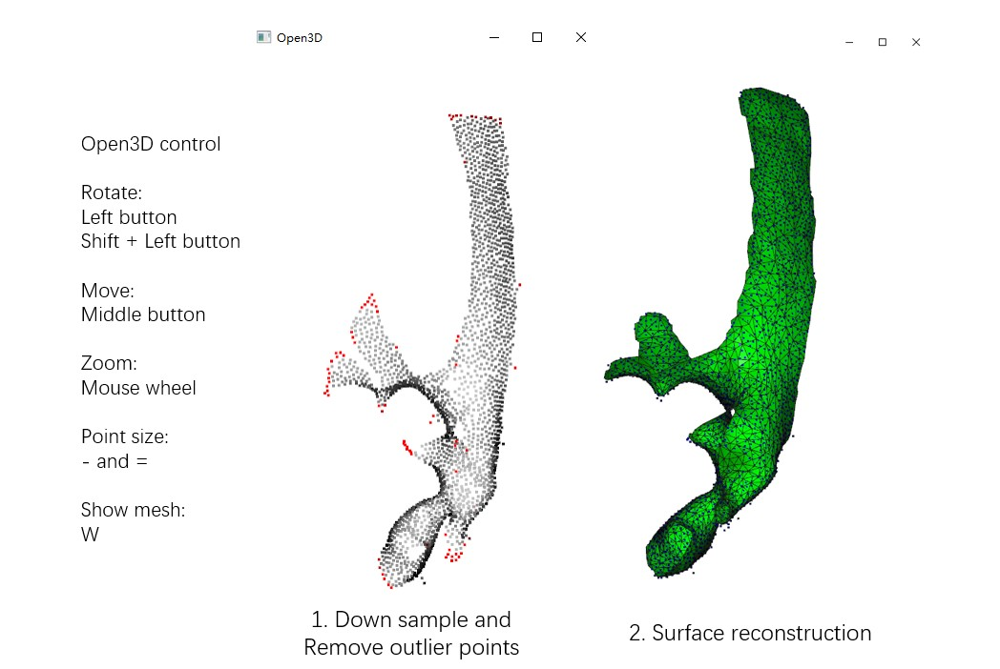

Run `Mpicker_generatemesh.py -h` to see more details. `--thres` is the density threshold in surface reconstruction (density is drawn in green), influencing surface completeness. Decrease it if `--down` is increased. `--tri_area` affects the number of triangles. Adjust it if OptCuts encounters issues during processing.

Now a mesh, `surf1.obj`, is available.

- ### UV Unwrapping by OptCuts

To obtain texture coordinates with less distortion, process the mesh with OptCuts. A simple wrapper for it is provided. Run:
```bash
Mpicker_optcuts.py --fin surf1.obj --fout surf1_b4.04.obj --energy 4.04 # --show 1
```

`--energy` should always be `> 4` (default is 4.1). Decreasing it can flatten the surface with less distortion but may cut the surface into more patches. `4.04` is chosen here, and it should finish in about 1 minute.

Sometimes, OptCuts may encounter errors like `***Element inversion detected: -1.4646e-17 < 0` or get stuck at the first iteration with messages such as `E_initial = inf`. In most cases, this happens because the input mesh is not a topological disk or closed surface. To solve it, `Mpicker_meshparam.py` can be used to calculate an initial parameterization at first, as discussed above. For example:
```bash
Mpicker_meshparam.py --fin surf1.obj --fout surf1_uv.obj
Mpicker_optcuts.py --fin surf1_uv.obj --fout surf1_b4.04.obj --energy 4.04 # --show 1
```
Notice that the original OptCuts may ignore the initial parameterization, which is why the modified version on the website should be used.

If `--show 1` or `--show 2` is added when running `Mpicker_optcuts.py`, the intermediate process can be visualized in 3D as below, and it will be saved in a folder. `useful_files/OptCuts_output` is a demo output. For more details, refer to OptCuts' GitHub (https://github.com/liminchen/OptCuts).

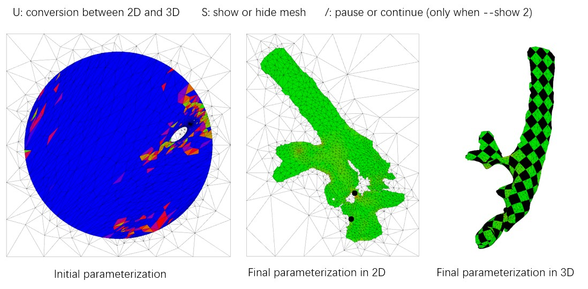

Now, a mesh with texture coordinates, `surf1_b4.04.obj`, is available. The demo output `useful_files/surf1_b4.04.obj` (or `useful_files/OptCuts_output/finalResult_mesh_normalizedUV.obj`) is also provided.

- ### Obtain the Flattened Tomogram

Now, the membrane can be flattened from the raw tomogram and the obj file by:
```bash
Mpicker_flattenmesh.py --fin surf1_b4.04.obj --fout emd10409_isonet/surface_1_emd10409_isonet --ftomo emd10409_isonet.mrc \
--thick 15 --rbf_dist 10 --id1 1 --id2 2 --filt # --show_3d
```

It will generate four files starting with `surface_1-2` in the `--fout` folder. These files are necessary for the GUI to recognize, so they are outputted to the folder of `surface1`. The `--show3d` option will display the intermediate process in 3D, as shown below. The resulting flattened tomogram is located at `emd10409_isonet/surface_1_emd10409_isonet/surface_1-2_RBF_10_thick_15_result.mrc`. The `--filt` option indicates that only the region of the mesh is preserved in the flattened tomogram, without extrapolation. Other parameters are the same as those in the GUI.

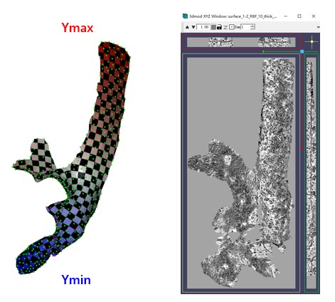

The checkerboard pattern visualizes the xy coordinates in the flattened tomogram, while the color represents the y coordinates in the flattened tomogram.As before, MPicker samples points in texture coordinates (uv) with a distance of more than 10 and performs thin plate interpolation. The only difference here is that three functions of uv are fit to describe xyz separately. 

The membrane here might not be as flat as before. This deviation might occur during the surface generation process, as Poisson surface reconstruction is a type of implicit method.

- ### Check the Result

Now, reopen MPicker:
```bash
Mpicker_gui.py --config emd10409_isonet.config &
```

The obtained flattened tomogram should be recognized by MPicker as surface1-2. It can be treated like any other tomogram generated in the GUI. To check the distortion, press `Area` or `Stretch`. Additionally, the result can be examined in 3D by pressing `3D`.

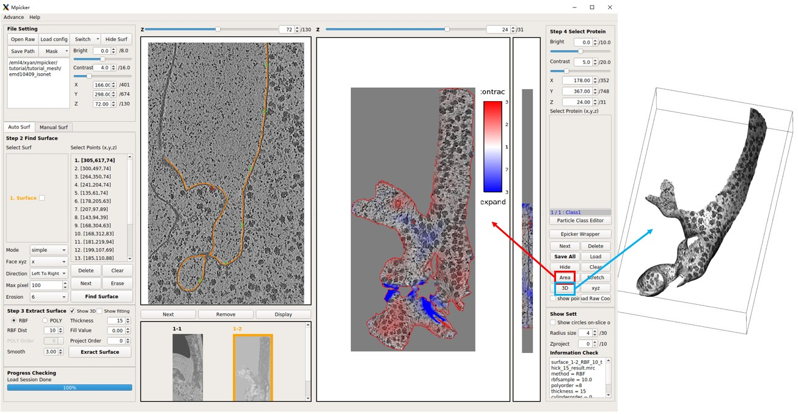

Although the flattening is not perfect, it is significantly improved compared to surface1-1.