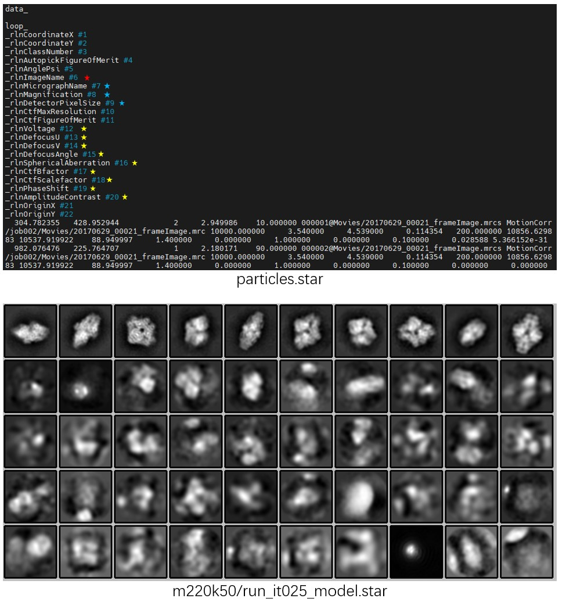
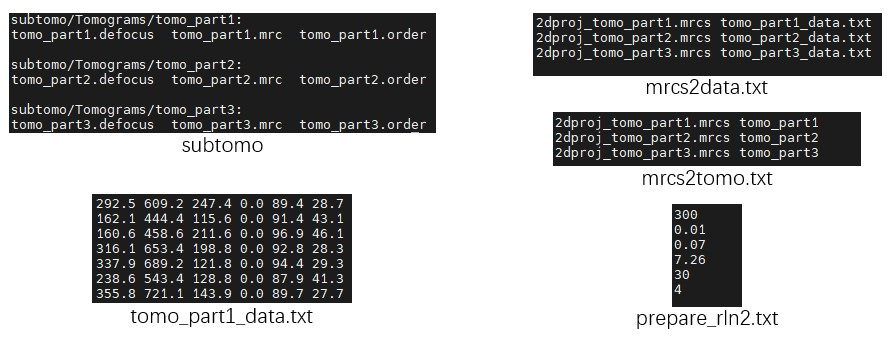
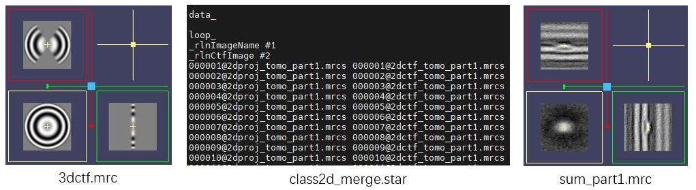
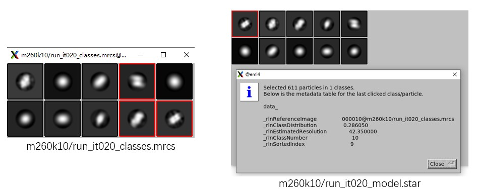
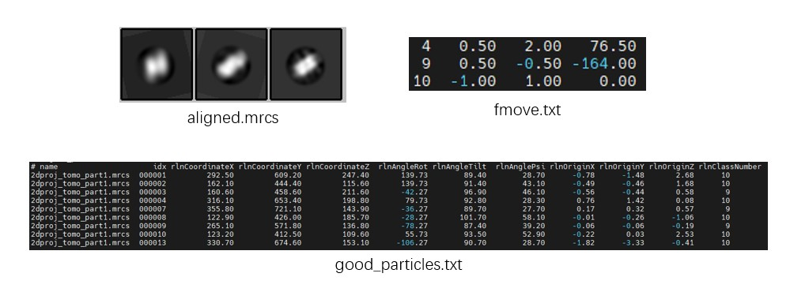
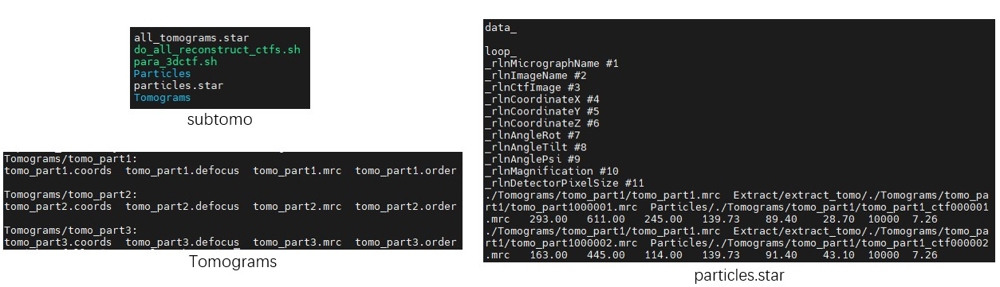
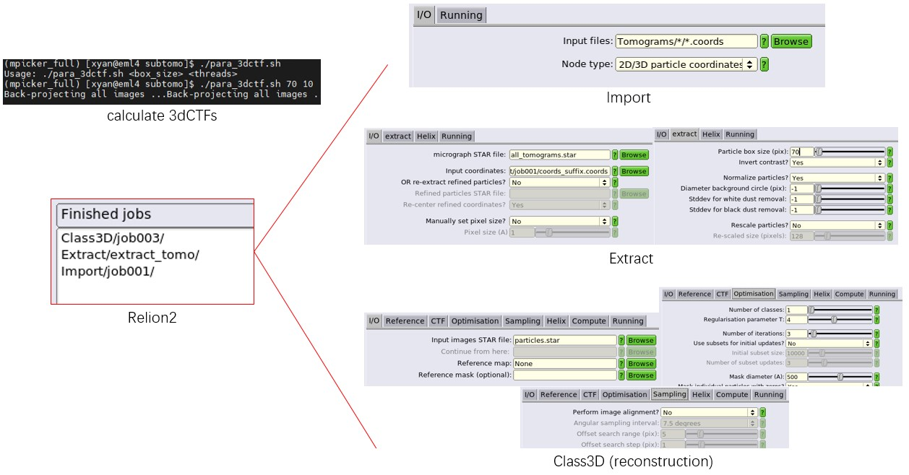
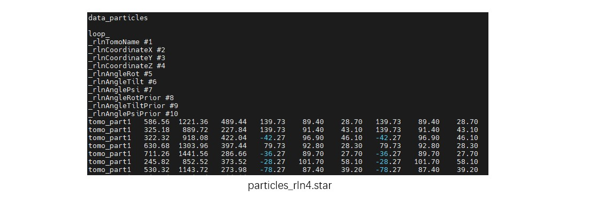

# 2D Classification

This tutorial describes how to perform 2D classification (Class2D) using `MPicker_class2d.py`. It uses the EM algorithm similar to Relion, but supports custom 2dCTF and runs faster. The program depends on PyTorch and supports GPU acceleration. The output format of `MPicker_class2d.py` is compatible with Relion, so the Relion program `relion_display` is used here to visualize the Class2D results.

For the complete workflow — including extracting particle projections from tomograms, generating 2dCTFs, running 2D classification, and converting the classification results into files usable for subsequent subtomogram averaging (STA) — please download the full tutorial package `MPicker_tutorial_class2d_v1.3.0.tar.bz2` (3G) from [Download](https://thuem.net/software/mpicker/download.html). To focus only on the 2D classification itself, a smaller tutorial package `MPicker_tutorial_class2d_part_v1.3.0.tar.bz2` (300M) is also available, which does not include the folder `class2d_full_workflow`.

First, extract the tutorial package in an empty directory:

```bash
tar -jxvf MPicker_tutorial_class2d_v1.3.0.tar.bz2

ls # should contain 3 folders: class2d_full_workflow, class2d_SPA, class2d_tomo
```

## Class2D of SPA Data

First, start with conventional single-particle analysis (SPA) data. The beta-galactosidase dataset from the Relion 3 tutorial (ftp://ftp.mrc-lmb.cam.ac.uk/pub/scheres/relion30_tutorial.pdf) is used here for testing. There are about 7,000 particles in total, with a image size of 64×64 pixels.

Enter the folder `class2d_SPA`. Here, the file `particles.star` records particle information in STAR format (same as Relion), the folder `Movies` contains the particle files, and `cmd.txt` records the commands to be used.

The most important column in `particles.star` is `rlnImageName` (highlighted in red), which specifies the location of the particle files (mrcs) and must be provided.

`rlnMicrographName` is used for particle grouping here. In practice, `MPicker_class2d.py` performs grouping according to the priority `rlnOpticsGroup`, `rlnGroupName`, and `rlnMicrographName`. If none of these are provided, all particles are treated as belonging to a single group.

`rlnMagnification` and `rlnDetectorPixelSize` determine the pixel size of the particles, which must be consistent for all particles. If these are not provided, the pixel size must be specified when running `MPicker_class2d.py`.

CTF-related information such as `rlnVoltage` (highlighted in yellow) is used to compute the CTF for each particle. If not provided, CTF is not considered during 2D classification. Alternatively, `rlnCtfImage` can be used to specify the location of a 2dCTF file (mrcs) for each particle, allowing the 2dCTF to be directly used as the particle CTF. This is required later when processing tomogram projection particles.

Other information in the STAR file is not used.

To perform 2D classification with `MPicker_class2d.py`, run the following command. A single 2080 Ti GPU was used here, and the computation took about **3 minutes**.

```bash
Mpicker_class2d.py -i particles.star -o m220k50/run -d 220 -k 50 -g 0 # -p 3.54 -n 25 --normalize

relion_display --gui # choose m220k50/run_it025_model.star
```

Here, `-i` specifies the input STAR file, `-o` specifies the output prefix, `-d` specifies the mask diameter, and `-k` specifies the number of classes.

`-g` specifies the GPU ID to use (CPU is used by default if not specified). Multiple GPUs can be specified as `-g 0,1,2`. In this case, because the particle size is small, the number of particles is limited, and the sampling interval is relatively large, so using multiple GPUs does not bring a significant speedup.

`-p` specifies the pixel size, but it can be skipped here because the information is already included in `particles.star`. `-n` specifies the number of iterations, with a default value of 25. `--normalize` enables normalization based on the mean and standard deviation of each particle, but the particles here were already normalized during extraction, so this option can be skipped.

To inspect the results, run `relion_display --gui`, then select `m220k50/run_it025_model.star`, and then check `Sort images on rlnClassDistribution` and `Reverse sort`. A result similar to the figure below will be obtained. Alternatively, the classification result can be viewed directly with `relion_display --i m220k50/run_it025_classes.mrcs`.



Note that in the `_data.star` file, `rlnNrOfSignificantSamples` records the exponential of the information entropy computed from the particle probability distribution (including class, translation, and rotation), i.e. `int(2^sum(-P*logP))`. This definition is different from that used in Relion.

## Class2D of Tomogram Projections

Here, PSII particles from Chlamydomonas tomograms are first projected along the membrane normal. 2D classification is then used to determine particle orientations, and the Class2D results are finally converted into files that can be directly used for STA in Relion.

The data used in this tutorial are from [EMPIAR-12469](https://www.ebi.ac.uk/empiar/EMPIAR-12469/). To reduce file size, the folder `class2d_full_workflow` contains only a subset of the tomograms for demonstrating the workflow (about 1,600 particles in total). The folder `class2d_tomo` contains the complete set of particle projections (about 5,300 particles), but does not include tomograms and is only for testing the Class2D step. The steps beyond 2D classification are also described in the **Get Input Files for Class2D** and **Process the Result from Class2D** sections of the [Advanced Tutorial](https://thuem.net/software/mpicker/tutorial_advance.html#get-input-files-for-class2d).

### About Tutorial Files

Enter the folder `class2d_full_workflow`. Its contents are as follows:

* The folder `subtomo` contains three small tomograms, organized in a format similar to that used by Relion 3.0 for STA.
* The files `tomo_part*_data.txt` record particle coordinates and angles for each tomogram. These files can be exported from MPicker GUI picking results using `Mpicker_particles.py`. Each file contains six columns: x, y, z, rot, tilt, and psi. Since the membrane normal vector only determines tilt and psi, so the rot is set to 0 here.
* The file `cmd.txt` records the commands to be used.
* The files `mrcs2data.txt` and `mrcs2tomo.txt` are used during data conversion, and establishes the correspondence between particle projection files (mrcs), particle orientation files (_data.txt), and tomogram names.
* The file `prepare_rln2.txt` helps prepare the files required by STA in Relion 2 or Relion 3.0, without using the official `relion_prepare_subtomograms.py` workflow. It contains six values: Voltage (kV), Cs (mm), AmpContrast, PixelSize (Å), UseOnlyLowerTiltDefociLimit (degree), and Bfactor.



### Prepare Files for Class2D

First, generate a 3dCTF file for each tomogram using `Mpicker_3dctf.py`, similar to the [Advanced Tutorial](https://thuem.net/software/mpicker/tutorial_advance.html#get-input-files-for-class2d). The three tomograms here originate from the same large tomogram, so a single `3dctf.mrc` file is enough. The option `--cos` reduces the intensity in high-tilt regions according to the cosine of the tilt angle, similar to Relion. `--box 70` specifies a 3dCTF size of 70×70×70 pixels.

Then use `Mpicker_2dprojection_torch.py` to extract particle projections (`--output`) and 2dCTF files (`--ctfout`) from the tomogram (`--map`) and the 3dCTF file (`--ctf`), based on particle coordinates and orientations (`--data`). The extraction results are recorded in a STAR file (`--star`) for subsequent 2D classification. `--dxy` specifies the projection image size and must match the 3dCTF size. `--dz` specifies the projection depth, approximately corresponding to the thickness of the stromal side of PSII. `--invert` inverts the contrast so that particles appear white. `--tomoout` is optional and outputs an averaged 3D density map to help check particle centering and membrane position. The commands are as follows:

```bash
Mpicker_3dctf.py --df 58381 --pix 7.26 --box 70 --t1 -58.36 --t2 55.07 --cos --out 3dctf.mrc

Mpicker_2dprojection_torch.py --map subtomo/Tomograms/tomo_part1/tomo_part1.mrc --ctf 3dctf.mrc \
--data tomo_part1_data.txt --dxy 70 --dz 7 --invert --gpuid 0 \
--output 2dproj_tomo_part1.mrcs --ctfout 2dctf_tomo_part1.mrcs --star class2d_merge.star \
--tomoout sum_part1.mrc
```

Repeat the procedure for the remaining two tomograms, `tomo_part2.mrc` and `tomo_part3.mrc`. Since the results need to be appended to the same STAR file, add the option `--conti`.

```bash
Mpicker_2dprojection_torch.py --map subtomo/Tomograms/tomo_part2/tomo_part2.mrc --ctf 3dctf.mrc \
--data tomo_part2_data.txt --dxy 70 --dz 7 --invert --gpuid 0 \
--output 2dproj_tomo_part2.mrcs --ctfout 2dctf_tomo_part2.mrcs --star class2d_merge.star \
--tomoout sum_part2.mrc --conti

Mpicker_2dprojection_torch.py --map subtomo/Tomograms/tomo_part3/tomo_part3.mrc --ctf 3dctf.mrc \
--data tomo_part3_data.txt --dxy 70 --dz 7 --invert --gpuid 0 \
--output 2dproj_tomo_part3.mrcs --ctfout 2dctf_tomo_part3.mrcs --star class2d_merge.star \
--tomoout sum_part3.mrc --conti
```



### Class2D

Run 2D classification using the merged `class2d_merge.star`. Here, 10 classes and 20 iterations are used, with a pixel size of 7.26 Å and a mask diameter of 260 Å. A single 2080 Ti GPU was used, and the computation took less than half a minute.

Compared with SPA data, 2D classification of tomogram projections is more challenging and prone to overfitting. Therefore, `--mask_noise` is enabled to fill regions outside the particle mask with phase-randomized noise (zeros are used by default). In addition, `--T` is reduced to 1 (default is 2) to produce smoother results. In some cases, setting `--skip_mask_ref` to skip masking the reference may also give better results.

Since the projections were not normalized during extraction, `--normalize` is used here to normalize particles based on their mean and std. `--load_in_memory` loads all particle files into memory at the beginning to reduce file I/O. `--seed` sets the random seed to make the results reproducible.

The commands are as follows:

```bash
Mpicker_class2d.py -i class2d_merge.star -o m260k10/run -k 10 -n 20 -g 0 -p 7.26 -d 260 \
--mask_noise --T 1 --normalize --load_in_memory --seed 42

# Mpicker_class2d.py -i class2d_merge.star -o m260k10_skiprefmask/run -k 10 -n 20 -g 0 -p 7.26 \
# -d 260 --mask_noise --T 1 --normalize --load_in_memory --skip_mask_ref --seed 42

relion_display --i m260k10/run_it020_classes.mrcs

# relion_display --gui # m260k10/run_it020_model.star
```

After classification, use Relion `relion_display` to inspect the 2D class averages in `_classes.mrcs`. To sort classes by particle distribution, open the GUI with `relion_display --gui` and select the `_model.star` file.



### From Class2D to STA

Because only a small number of particles are used here, the classification result is not ideal. Just for demonstration purposes, assume that the three classes marked by red boxes (classes 4, 9, and 10) correspond to the target particles. The procedure is similar to that described in the [Advanced Tutorial](https://thuem.net/software/mpicker/tutorial_advance.html#process-the-result-from-class2d). The actual results may differ from the figures shown here, so select good classes according to your result.

Since the selected classes may not be aligned to each other, so align them using `Mpicker_align_class2d.py` at first. This generates `fmove.txt`, which records the translation and rotation corrections for each class. Manual alignment is also possible (write `fmove.txt` by hand). The file `fmove.txt` contains four columns: class number (`rlnClassNumber`), x shift (pixels), y shift (pixels), and rotation angle (degrees).

The commands are as follows. `--mo` is optional and outputs the aligned 2D averages. `--one` indicates that class ID starts from 1, rather than 0 (as in THUNDER). `--ids` specifies the class IDs to keep, `--ref` specifies the reference ID (the clearest one is used here), and `--refxy` specifies the reference center coordinates (pixels) in the IMOD coordinate system, but starting from 0.

```bash
Mpicker_align_class2d.py --i m260k10/run_it020_classes.mrcs --o fmove.txt --mo aligned.mrcs \
--one --ids 4,9,10 --ref 10 --refxy 36,34

relion_display --i aligned.mrcs
```

Next, convert the Class2D result `_data.star` into 3D particle coordinates and Euler angles using `Mpicker_convert_class2d.py`. Here, `--data` contains the coordinates and angles used during projection extraction for each tomogram. `--star` is the Class2D result. `--out2` outputs the converted 3D coordinates and Euler angles. `--out` just summarizes the Class2D results together with the projection parameters, without conversion, and is usually not needed.

```bash
Mpicker_convert_class2d.py --data mrcs2data.txt --star m260k10/run_it020_data.star \
--fmove fmove.txt --out2 good_particles.txt
```



Since Class2D corrects particle shifts on the membrane surface, `good_particles.txt` also contains `rlnOrigin[XYZ]`. As in Relion, the corrected X coordinate is given by `rlnCoordinateX - rlnOriginX`.

### Prepare STA Files for Relion

To further simplify the preparation of STA files, MPicker provides scripts to generate the files required by Relion. `Mpicker_prepare_rln2.py` prepares files for Relion 2 (or 3.0), while `Mpicker_prepare_rln4.py` prepares files for Relion 4 (or 5). From our experience, for challenging proteins, first refining in Relion 2 (or 3.0) and then refining in Relion 4 may give a better result, although Relion 2 is less convenient to use.

To prepare files for **Relion 2**, use the following command. Here, `--i` is the file containing particle coordinates and Euler angles obtained above. `--l` lists the tomogram names (corresponding to folder names under `Tomograms`). `--p` specifies the pixel size to be written into the final `particles.star`. `--o` specifies the output folder for `particles.star` and the `.coords` files.

If `--prepare_all` is provided, the official `relion_prepare_subtomograms.py` step can be skipped. In this case, the output folder `--o` must contain a `Tomograms` folder, with one subfolder per tomogram, each containing `.defocus`, `.mrc`, and `.order` files. `Mpicker_prepare_rln2.py` then writes the particle coordinates of each tomogram into `.coords` files.

```bash
Mpicker_prepare_rln2.py --i good_particles.txt --l mrcs2tomo.txt \
--o subtomo --p 7.26 --prepare_all prepare_rln2.txt
```



After this, follow the official Relion 2 workflow to compute the 3dCTF for each particle, extract particles (the job alias must be set to `extract_tomo`), and run Refine3D or Class3D using the `particles.star` generated by MPicker. The official Relion 2 workflow can be found at [https://doi.org/10.1038/nprot.2016.124](https://doi.org/10.1038/nprot.2016.124) or [https://www3.mrc-lmb.cam.ac.uk/relion/index.php?title=Sub-tomogram_averaging](https://www3.mrc-lmb.cam.ac.uk/relion/index.php?title=Sub-tomogram_averaging).



Using **Relion 4** directly is more convenient, since particle coordinates and orientations can be specified directly in the particle file. The command is as follows. The meanings of `--i` and `--l` are the same as above. `--o` specifies the output STAR file containing all particle information. `--s` specifies the coordinate scaling factor, because the tomograms here are bin2, while Relion 4 typically uses bin1 data.

```bash
Mpicker_prepare_rln4.py --i good_particles.txt --l mrcs2tomo.txt \
--o subtomo/particles_rln4.star --s 2

# Mpicker_prepare_rln4.py --i xxx_data.star --o particles_rln4.star --s 2 --from_rln2
```



When `--from_rln2` is enabled, `Mpicker_prepare_rln4.py` can also be used to convert Relion 2 results into a particle file supported by Relion 4.

## Class2D of All Projections

Finally, perform 2D classification using all PSII projection particles (about 5,300 particles), which can yield better results than before.

Enter the folder `class2d_tomo` and run the following commands. The option `--ctf_thres` is used to determine which regions belong to the missing wedge, with a default value of 0.001. Here, the 2dCTF is derived from Relion-generated 3dCTF and shows large fluctuations in the missing wedge region, so a larger threshold is used. Setting `--ctf_thres -1` can disable this feature, and its impact on the result is usually not significant.

```bash
Mpicker_class2d.py -i class2d_full.star -o m260k10_skiprefmask/run -k 10 -n 20 -g 0 \
-p 7.26 -d 260 --mask_noise --T 1 --normalize --load_in_memory \
--skip_mask_ref --seed 42 --ctf_thres 0.05

relion_display --gui &
```

A single 2080 Ti GPU was used here, and the computation took about **1 minute**.


